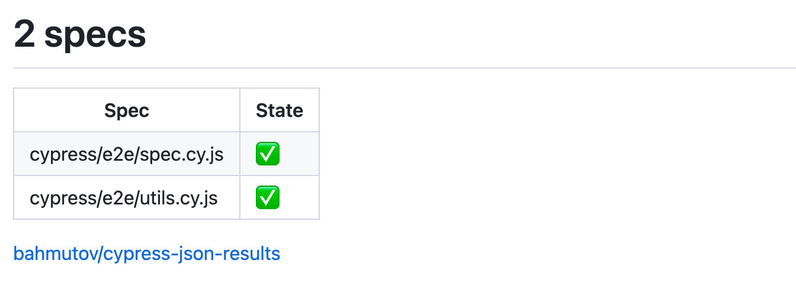
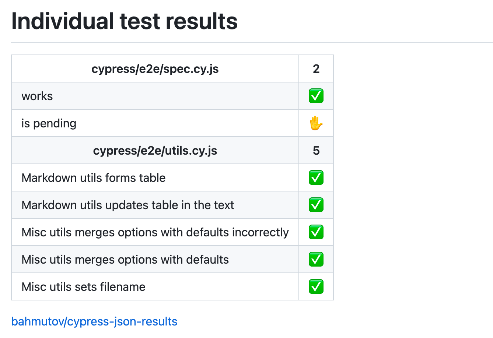

# cypress-json-results [![Build status][ci image]][ci url] [![renovate-app badge][renovate-badge]][renovate-app] 

> Saves Cypress test results as a JSON file

Read the blog post [Cypress JSON Test Results](https://glebbahmutov.com/blog/json-test-results/).

## Install

```shell
$ npm i -D cypress-json-results
# or using Yarn
$ yarn add -D cypress-json-results
```

Register this plugin from your plugin file

```js
// cypress/plugins/index.js
module.exports = (on, config) => {
  // save all test results as a JSON file
  // https://github.com/bahmutov/cypress-json-results
  require('cypress-json-results')({
    on,
    filename: 'results.json', // default filename
  })
}
```

After the run the JSON file should contain results for all test specs that ran locally and the total counts. See the [Cypress Test Statuses](https://glebbahmutov.com/blog/cypress-test-statuses/) blog post for details on the possible test status values.

```json
{
  "cypress/integration/spec.js": {
    "works": "passed",
    "is pending": "pending"
  },
  "totals": {
    "suites": 0,
    "tests": 2,
    "failed": 0,
    "passed": 1,
    "pending": 1,
    "skipped": 0
  }
}
```

## Options

### filename

By default, this plugin saves the JSON result into "results.json" file. You can change the output filename using the `filename` option

```js
// https://github.com/bahmutov/cypress-json-results
require('cypress-json-results')({
  on,
  filename: 'output.json',
})
```

**Note:** the plugin assumes the output folder already exists

You can disable writing a file by using the option `filename: false`.

### updateMarkdownFile

You can automatically update a Markdown table inside the given file with the test counts. See the section below [Cypress test counts](#cypress-test-counts) for an example. The table should be surrounded with HTML comments

```
<!-- cypress-test-counts -->
Test status | Count
---|---
Passed | 6
Failed | 0
Pending | 1
Skipped | 0
**Total** | 7
<!-- cypress-test-counts-end -->
```

Tip: prevent the Prettier from messing with the formatting by surrounding the table with ignore comments, see [How to configure Prettier and VSCode](https://glebbahmutov.com/blog/configure-prettier-in-vscode/).

```
<!-- prettier-ignore-start -->
<!-- cypress-test-counts -->
  ... table text ...
<!-- cypress-test-counts-end -->
<!-- prettier-ignore-end -->
```

## githubActionsSummary

If you are running the tests using [GitHub Actions](https://glebbahmutov.com/blog/trying-github-actions), you can output a summary table.

```js
require('cypress-json-results')({
  on,
  filename: false, // do not write JSON file
  githubActionsSummary: 'spec',
})
```

Value `githubActionsSummary: 'spec'` writes a single row per spec file.



Value `githubActionsSummary: 'test'` writes a single row per test.



## Cypress test counts

This repo has the following test numbers:

<!-- prettier-ignore-start -->
<!-- cypress-test-counts -->
Test status | Count
---|---
Passed | 3
Failed | 0
Pending | 1
Skipped | 0
**Total** | 4
<!-- cypress-test-counts-end -->
<!-- prettier-ignore-end -->

The table above is automatically updated nightly, see the [GitHub Actions workflow](./.github/workflows/test-counts.yml)

## Small print

Author: Gleb Bahmutov &lt;gleb.bahmutov@gmail.com&gt; &copy; 2022

- [@bahmutov](https://twitter.com/bahmutov)
- [glebbahmutov.com](https://glebbahmutov.com)
- [blog](https://glebbahmutov.com/blog)
- [videos](https://www.youtube.com/glebbahmutov)
- [presentations](https://slides.com/bahmutov)
- [cypress.tips](https://cypress.tips)
- [Cypress Advent 2021](https://cypresstips.substack.com/)

License: MIT - do anything with the code, but don't blame me if it does not work.

Support: if you find any problems with this module, email / tweet /
[open issue](https://github.com/bahmutov/cypress-json-results/issues) on Github

## MIT License

Copyright (c) 2022 Gleb Bahmutov &lt;gleb.bahmutov@gmail.com&gt;

Permission is hereby granted, free of charge, to any person
obtaining a copy of this software and associated documentation
files (the "Software"), to deal in the Software without
restriction, including without limitation the rights to use,
copy, modify, merge, publish, distribute, sublicense, and/or sell
copies of the Software, and to permit persons to whom the
Software is furnished to do so, subject to the following
conditions:

The above copyright notice and this permission notice shall be
included in all copies or substantial portions of the Software.

THE SOFTWARE IS PROVIDED "AS IS", WITHOUT WARRANTY OF ANY KIND,
EXPRESS OR IMPLIED, INCLUDING BUT NOT LIMITED TO THE WARRANTIES
OF MERCHANTABILITY, FITNESS FOR A PARTICULAR PURPOSE AND
NONINFRINGEMENT. IN NO EVENT SHALL THE AUTHORS OR COPYRIGHT
HOLDERS BE LIABLE FOR ANY CLAIM, DAMAGES OR OTHER LIABILITY,
WHETHER IN AN ACTION OF CONTRACT, TORT OR OTHERWISE, ARISING
FROM, OUT OF OR IN CONNECTION WITH THE SOFTWARE OR THE USE OR
OTHER DEALINGS IN THE SOFTWARE.

[ci image]: https://github.com/bahmutov/cypress-json-results/workflows/ci/badge.svg?branch=main
[ci url]: https://github.com/bahmutov/cypress-json-results/actions
[renovate-badge]: https://img.shields.io/badge/renovate-app-blue.svg
[renovate-app]: https://renovateapp.com/
